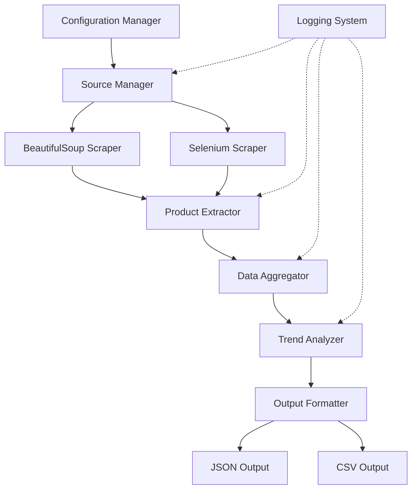

# Design Document: Organic Products Web Scraper

## Overview

The Organic Products Web Scraper is a Python-based system that identifies and ranks the top 5 trending organic products globally by aggregating data from multiple sources including B2C platforms (Amazon, Flipkart), B2B marketplaces, specialized organic product websites, and social media platforms. The system combines BeautifulSoup for static HTML parsing with Selenium for dynamic JavaScript-rendered content, implementing robust error handling, retry mechanisms, and trend analysis algorithms to provide reliable, real-time market insights.

### Key Design Principles

1. **Resilience**: The system continues operating despite individual source failures through comprehensive error handling and retry logic
2. **Modularity**: Clear separation between scraping, parsing, aggregation, and analysis components enables independent testing and maintenance
3. **Performance**: Concurrent requests, connection pooling, and intelligent caching optimize execution time while respecting rate limits
4. **Configurability**: External configuration files allow behavior customization without code changes

### Design Rationale

The hybrid approach of using BeautifulSoup for static content and Selenium for dynamic content is based on research showing that [BeautifulSoup processes static HTML approximately 70% faster](https://copyprogramming.com/howto/web-scraping-search-with-python-beautifulsoup-or-selenium) than browser automation, while Selenium is necessary for JavaScript-rendered pages and social media platforms. This combination optimizes both performance and capability.

The trend analysis algorithm incorporates multiple signals (mention frequency, recency, source diversity) to calculate trending scores, following patterns used by platforms like Twitter which detect [sudden increases in volume and velocity of mentions](https://www.quora.com/What-algorithm-is-used-to-find-trending-topics-on-Twitter) normalized by geography and relevance.

## Architecture

### System Components



### Component Responsibilities

**Configuration Manager**
- Loads settings from JSON/YAML configuration files
- Provides default values when configuration is missing
- Validates configuration parameters
- Exposes configuration to other components

**Source Manager**
- Manages connections to different data sources
- Determines whether to use BeautifulSoup or Selenium for each source
- Implements retry logic with exponential backoff
- Handles rate limiting and request delays
- Tracks source availability and failures

**BeautifulSoup Scraper**
- Fetches static HTML content using HTTP requests
- Parses HTML with BeautifulSoup library
- Handles malformed HTML gracefully
- Implements connection pooling and DNS caching

**Selenium Scraper**
- Automates browser interactions for dynamic content
- Implements headless browser mode
- Manages explicit waits for element loading
- Handles browser lifecycle (initialization, cleanup)
- Disables image/video loading for performance

**Product Extractor**
- Extracts structured product data from parsed HTML
- Uses CSS selectors and DOM traversal
- Validates extracted URLs and data formats
- Handles missing data fields gracefully

**Data Aggregator**
- Combines product data from multiple sources
- Deduplicates products across sources
- Normalizes product information
- Maintains metadata about source success/failure

**Trend Analyzer**
- Calculates trending scores based on multiple signals
- Implements weighted scoring algorithm
- Ranks products by trending score
- Handles tie-breaking with alphabetical sorting

**Output Formatter**
- Generates JSON and CSV output files
- Includes timestamps and metadata
- Creates output directories as needed
- Uses descriptive filenames with collection dates

**Logging System**
- Provides structured logging across all components
- Implements log levels (DEBUG, INFO, WARNING, ERROR)
- Writes to console and rotating log files
- Includes timestamps and context information

### Data Flow

1. Configuration Manager loads settings and initializes components
2. Source Manager determines target sources and scraping strategy
3. BeautifulSoup Scraper handles static content sources
4. Selenium Scraper handles dynamic content sources
5. Product Extractor parses HTML and extracts structured data
6. Data Aggregator combines and normalizes data from all sources
7. Trend Analyzer calculates scores and ranks products
8. Output Formatter generates JSON and CSV files
9. Logging System records all activities and errors

## Components and Interfaces

### Configuration Manager

```python
class ConfigurationManager:
    """Manages application configuration from files or defaults."""
    
    def load_config(self, config_path: str) -> Dict[str, Any]:
        """Load configuration from JSON/YAML file."""
        
    def get_sources(self) -> List[Dict[str, str]]:
        """Return list of configured data sources."""
        
    def get_timeout(self) -> int:
        """Return request timeout in seconds."""
        
    def get_retry_attempts(self) -> int:
        """Return number of retry attempts."""
        
    def get_output_directory(self) -> str:
        """Return output directory path."""
        
    def get_browser_type(self) -> str:
        """Return browser type for Selenium (chrome/firefox)."""
```

### Source Manager

```python
class SourceManager:
    """Manages connections and requests to data sources."""
    
    def __init__(self, config: ConfigurationManager, logger: Logger):
        """Initialize with configuration and logger."""
        
    def scrape_all_sources(self) -> List[Tuple[str, str, bool]]:
        """
        Scrape all configured sources.
        Returns list of (source_name, html_content, success) tuples.
        """
        
    def scrape_source(self, source: Dict[str, str]) -> Tuple[str, bool]:
        """
        Scrape single source with retry logic.
        Returns (html_content, success) tuple.
        """
        
    def _retry_with_backoff(self, func: Callable, max_attempts: int) -> Any:
        """Execute function with exponential backoff retry."""
        
    def _apply_rate_limit(self, domain: str) -> None:
        """Apply rate limiting delay for domain."""
```

### BeautifulSoup Scraper

```python
class BeautifulSoupScraper:
    """Handles static HTML scraping with BeautifulSoup."""
    
    def __init__(self, timeout: int, logger: Logger):
        """Initialize with timeout and logger."""
        
    def fetch_html(self, url: str) -> str:
        """Fetch HTML content from URL."""
        
    def parse_html(self, html: str) -> BeautifulSoup:
        """Parse HTML string into BeautifulSoup object."""
```

### Selenium Scraper

```python
class SeleniumScraper:
    """Handles dynamic content scraping with Selenium."""
    
    def __init__(self, browser_type: str, headless: bool, logger: Logger):
        """Initialize Selenium WebDriver."""
        
    def fetch_dynamic_html(self, url: str, wait_selector: str = None) -> str:
        """
        Fetch HTML from JavaScript-rendered page.
        Optionally wait for specific element to load.
        """
        
    def wait_for_element(self, selector: str, timeout: int = 10) -> bool:
        """Wait for element to appear on page."""
        
    def close(self) -> None:
        """Close browser and cleanup resources."""
```

### Product Extractor

```python
class ProductExtractor:
    """Extracts structured product data from HTML."""
    
    def __init__(self, logger: Logger):
        """Initialize with logger."""
        
    def extract_products(
        self, 
        soup: BeautifulSoup, 
        source_name: str,
        selectors: Dict[str, str]
    ) -> List[ProductRecord]:
        """
        Extract products from parsed HTML using CSS selectors.
        Returns list of ProductRecord objects.
        """
        
    def _extract_field(
        self, 
        element: Tag, 
        selector: str, 
        default: str = "Not Available"
    ) -> str:
        """Extract single field with fallback to default."""
        
    def _validate_url(self, url: str) -> bool:
        """Validate URL format."""
```

### Data Aggregator

```python
class DataAggregator:
    """Aggregates and normalizes product data from multiple sources."""
    
    def __init__(self, logger: Logger):
        """Initialize with logger."""
        
    def aggregate(
        self, 
        products_by_source: Dict[str, List[ProductRecord]]
    ) -> List[ProductRecord]:
        """
        Combine products from all sources.
        Handles deduplication and normalization.
        """
        
    def _deduplicate(self, products: List[ProductRecord]) -> List[ProductRecord]:
        """Remove duplicate products based on name similarity."""
        
    def _normalize_product(self, product: ProductRecord) -> ProductRecord:
        """Normalize product data (trim whitespace, standardize format)."""
```

### Trend Analyzer

```python
class TrendAnalyzer:
    """Analyzes product trends and calculates ranking scores."""
    
    def __init__(self, logger: Logger):
        """Initialize with logger."""
        
    def calculate_trending_scores(
        self, 
        products: List[ProductRecord]
    ) -> List[Tuple[ProductRecord, float]]:
        """
        Calculate trending score for each product.
        Returns list of (product, score) tuples.
        """
        
    def rank_products(
        self, 
        scored_products: List[Tuple[ProductRecord, float]]
    ) -> List[ProductRecord]:
        """
        Rank products by score (descending).
        Tie-breaking by alphabetical order.
        """
        
    def get_top_n(
        self, 
        ranked_products: List[ProductRecord], 
        n: int = 5
    ) -> List[ProductRecord]:
        """Return top N products."""
        
    def _calculate_frequency_score(self, product: ProductRecord) -> float:
        """Calculate score based on mention frequency."""
        
    def _calculate_recency_score(self, product: ProductRecord) -> float:
        """Calculate score based on mention recency."""
        
    def _calculate_diversity_score(self, product: ProductRecord) -> float:
        """Calculate score based on source diversity."""
```

### Output Formatter

```python
class OutputFormatter:
    """Formats and writes output files."""
    
    def __init__(self, output_dir: str, logger: Logger):
        """Initialize with output directory and logger."""
        
    def write_json(
        self, 
        products: List[ProductRecord], 
        metadata: Dict[str, Any]
    ) -> str:
        """Write products to JSON file. Returns filename."""
        
    def write_csv(
        self, 
        products: List[ProductRecord], 
        metadata: Dict[str, Any]
    ) -> str:
        """Write products to CSV file. Returns filename."""
        
    def _generate_filename(self, extension: str) -> str:
        """Generate filename with timestamp."""
        
    def _ensure_output_directory(self) -> None:
        """Create output directory if it doesn't exist."""
```

## Data Models

### ProductRecord

```python
@dataclass
class ProductRecord:
    """Represents a single product with extracted information."""
    
    name: str
    price: str  # String to handle "Not Available" and currency symbols
    source: str
    link: str
    image_url: str
    timestamp: datetime
    mentions: int = 1  # Number of times product appears across sources
    sources_list: List[str] = field(default_factory=list)  # All sources mentioning product
    
    def __post_init__(self):
        """Validate required fields after initialization."""
        if not self.name:
            raise ValueError("Product name is required")
        if not self.source:
            raise ValueError("Product source is required")
```

### ScrapingResult

```python
@dataclass
class ScrapingResult:
    """Represents the result of a scraping operation."""
    
    source_name: str
    success: bool
    html_content: Optional[str] = None
    error_message: Optional[str] = None
    timestamp: datetime = field(default_factory=datetime.now)
    response_time: float = 0.0  # Seconds
```

### TrendingScore

```python
@dataclass
class TrendingScore:
    """Represents a product's trending score components."""
    
    product: ProductRecord
    frequency_score: float  # Based on mention count
    recency_score: float    # Based on timestamp recency
    diversity_score: float  # Based on source diversity
    total_score: float      # Weighted combination
    
    def calculate_total(
        self, 
        frequency_weight: float = 0.4,
        recency_weight: float = 0.4,
        diversity_weight: float = 0.2
    ) -> float:
        """Calculate weighted total score."""
        return (
            self.frequency_score * frequency_weight +
            self.recency_score * recency_weight +
            self.diversity_score * diversity_weight
        )
```

### Configuration

```python
@dataclass
class ScraperConfiguration:
    """Application configuration settings."""
    
    sources: List[Dict[str, str]]  # List of {name, url, type, selectors}
    timeout: int = 30
    retry_attempts: int = 3
    output_directory: str = "./output"
    browser_type: str = "chrome"
    headless: bool = True
    request_delay_min: float = 1.0
    request_delay_max: float = 3.0
    max_concurrent_requests: int = 5
    log_level: str = "INFO"
    log_file: str = "scraper.log"
    max_log_size_mb: int = 10
```

### OutputMetadata

```python
@dataclass
class OutputMetadata:
    """Metadata included in output files."""
    
    collection_timestamp: datetime
    total_sources_configured: int
    sources_successfully_scraped: List[str]
    sources_failed: List[str]
    total_products_found: int
    top_products_count: int
    scraping_duration_seconds: float
    version: str = "1.0.0"
```

## Correctness Properties

*A property is a characteristic or behavior that should hold true across all valid executions of a system—essentially, a formal statement about what the system should do. Properties serve as the bridge between human-readable specifications and machine-verifiable correctness guarantees.*

Before defining properties, I need to assess whether property-based testing is appropriate for this feature. This web scraper involves:
- External HTTP requests and network I/O
- HTML parsing with variable structure
- Browser automation with Selenium
- File system operations
- Integration with external websites

However, there are core logic components that ARE suitable for property-based testing:
- Product extraction logic (parsing HTML to structured data)
- Trend analysis and ranking algorithms
- Data aggregation and deduplication
- URL validation
- Configuration parsing

The system has testable pure functions and business logic that can benefit from property-based testing, particularly around data transformation, ranking, and validation. I will now use the prework tool to analyze which acceptance criteria are suitable for properties.


### Property 1: Product Extraction Completeness

*For any* valid HTML containing product information with the required selectors, the Product_Extractor SHALL extract all required fields (name, price, source, link, image URL) and create a valid ProductRecord.

**Validates: Requirements 2.1, 2.2, 2.3, 2.4, 2.5**

### Property 2: URL Validation Correctness

*For any* string input, the URL validation function SHALL return true for properly formatted URLs (with valid scheme, domain, and path) and false for malformed URLs.

**Validates: Requirements 2.8**

### Property 3: Malformed HTML Resilience

*For any* malformed HTML input (missing closing tags, invalid nesting, broken attributes), the BeautifulSoup parser SHALL handle the input without raising exceptions and return a parseable BeautifulSoup object.

**Validates: Requirements 4.2**

### Property 4: Product Mention Aggregation Accuracy

*For any* collection of ProductRecords from multiple sources, when products with identical or similar names are aggregated, the mention count SHALL equal the number of sources containing that product.

**Validates: Requirements 3.1**

### Property 5: Trending Score Calculation Consistency

*For any* ProductRecord with known frequency, recency, and source diversity values, the calculated trending score SHALL be a weighted combination of these three components with consistent weights across all products.

**Validates: Requirements 3.2**

### Property 6: Product Ranking with Tie-Breaking

*For any* list of products with trending scores, the ranking SHALL order products by score in descending order, and when multiple products have identical scores, they SHALL be ordered alphabetically by product name.

**Validates: Requirements 3.3, 3.4**

### Property 7: Recency Weighting Priority

*For any* two ProductRecords with identical mention counts and source diversity, the product with more recent timestamps (within past 7 days for search results, within past 24 hours for social media) SHALL receive a higher trending score than the product with older timestamps.

**Validates: Requirements 3.5, 3.6**

### Property 8: Data Validation Enforcement

*For any* ProductRecord, before adding to the aggregated dataset, validation SHALL verify that required fields (name, source) are non-empty and URLs (link, image_url) are either properly formatted or marked as "Not Available".

**Validates: Requirements 6.7**

### Property 9: JSON Serialization Round-Trip

*For any* list of valid ProductRecords with metadata, serializing to JSON and then deserializing SHALL produce an equivalent data structure with all product information preserved.

**Validates: Requirements 7.1, 7.3**

### Property 10: CSV Serialization Completeness

*For any* list of valid ProductRecords, serializing to CSV format SHALL produce rows containing all required fields (name, price, source, link, image_url) for each product.

**Validates: Requirements 7.2, 7.3**

### Property 11: Configuration Loading Validity

*For any* valid JSON or YAML configuration file containing required fields (sources, timeout, retry_attempts, output_directory, browser_type), the Configuration Manager SHALL successfully parse the file and return a ScraperConfiguration object with all specified values.

**Validates: Requirements 8.1**

## Error Handling

The scraper implements comprehensive error handling at multiple levels to ensure resilience:

### Network Error Handling

**Retry with Exponential Backoff**: When network errors occur (connection timeout, DNS failure, connection reset), the Source Manager implements retry logic with exponential backoff. Following [best practices for web scraping](https://guides.proxiesapi.com/posts/retries-timeouts-backoff-python-scraping), the system waits progressively longer between retries: 1 second, 2 seconds, 4 seconds, up to a maximum of 3 attempts.

**HTTP Error Handling**: 
- **403 Forbidden / 429 Too Many Requests**: Log the blocking event and skip the source
- **404 Not Found**: Log warning and skip the specific URL
- **5xx Server Errors**: Retry with backoff (may be temporary)

**Timeout Handling**:
- Request timeout: 30 seconds per request
- Element wait timeout: 10 seconds for Selenium explicit waits
- Total scraping timeout: 300 seconds (5 minutes) for all sources

### Parsing Error Handling

**Malformed HTML**: BeautifulSoup's lenient parser handles malformed HTML gracefully. When expected elements are missing:
- Log warning with source name and missing element details
- Use default value ("Not Available") for optional fields
- Skip product if required fields (name, source) are missing
- Continue processing remaining products

**CAPTCHA Detection**: When CAPTCHA is detected (common indicators in HTML):
- Log detection event with source name
- Skip the source entirely
- Continue with remaining sources
- Include in failed sources metadata

### Browser Automation Error Handling

**Selenium Exceptions**:
- `TimeoutException`: Log timeout and skip source
- `WebDriverException`: Log error, close browser, skip source
- `NoSuchElementException`: Log warning, use default value, continue
- All exceptions caught to prevent termination of entire scraping process

**Browser Cleanup**: Ensure browser instances are closed properly using try-finally blocks to prevent resource leaks.

### Data Validation Error Handling

**Invalid Data Detection**:
- Empty product names: Skip product, log warning
- Invalid URLs: Mark as "Not Available", log warning
- Missing required fields: Skip product, log error
- Duplicate products: Merge mentions, keep most complete record

**Insufficient Data**: If fewer than 2 sources are successfully scraped, raise `InsufficientDataException` with details about which sources failed and why.

### Rate Limiting

**Request Delays**: Implement random delays between 1-3 seconds between requests to the same domain to avoid triggering rate limits. Following [rate limiting best practices](https://substack.thewebscraping.club/p/rate-limit-scraping-exponential-backoff), this respects server resources and reduces blocking risk.

**Concurrent Request Limits**: Maximum 5 concurrent connections across all domains to prevent overwhelming the system or triggering anti-scraping measures.

### Logging Strategy

All errors are logged with appropriate severity levels:
- **ERROR**: Exceptions, failed sources, insufficient data
- **WARNING**: Missing elements, CAPTCHA detection, skipped products
- **INFO**: Successful extractions, source completion, ranking results
- **DEBUG**: HTTP requests, HTML parsing details, timing information

## Testing Strategy

The testing strategy employs a dual approach combining property-based testing for core logic with example-based unit tests and integration tests for external interactions.

### Property-Based Testing

Property-based tests will be implemented using **Hypothesis** (Python's leading property-based testing library) to verify universal properties across randomly generated inputs. Each property test will run a minimum of 100 iterations to ensure comprehensive coverage.

**Test Configuration**:
```python
from hypothesis import given, settings
import hypothesis.strategies as st

@settings(max_examples=100)
@given(...)
def test_property_name(...):
    # Property: organic-products-web-scraper, Property 1: Product Extraction Completeness
    ...
```

**Property Test Coverage**:

1. **Product Extraction Completeness** (Property 1)
   - Generate random HTML with product data using various structures
   - Verify all required fields are extracted
   - Test with missing optional fields (price, image)
   - Tag: `Feature: organic-products-web-scraper, Property 1: Product Extraction Completeness`

2. **URL Validation Correctness** (Property 2)
   - Generate random valid and invalid URL strings
   - Verify validation returns correct boolean
   - Test edge cases (missing scheme, invalid characters, localhost)
   - Tag: `Feature: organic-products-web-scraper, Property 2: URL Validation Correctness`

3. **Malformed HTML Resilience** (Property 3)
   - Generate random malformed HTML (missing tags, broken nesting)
   - Verify parser doesn't crash
   - Verify parseable object is returned
   - Tag: `Feature: organic-products-web-scraper, Property 3: Malformed HTML Resilience`

4. **Product Mention Aggregation Accuracy** (Property 4)
   - Generate random product lists from multiple sources
   - Verify mention counts match source count
   - Test deduplication logic
   - Tag: `Feature: organic-products-web-scraper, Property 4: Product Mention Aggregation Accuracy`

5. **Trending Score Calculation Consistency** (Property 5)
   - Generate random products with known score components
   - Verify weighted calculation is consistent
   - Test score ranges (0.0 to 1.0)
   - Tag: `Feature: organic-products-web-scraper, Property 5: Trending Score Calculation Consistency`

6. **Product Ranking with Tie-Breaking** (Property 6)
   - Generate random scored products including ties
   - Verify descending score order
   - Verify alphabetical tie-breaking
   - Tag: `Feature: organic-products-web-scraper, Property 6: Product Ranking with Tie-Breaking`

7. **Recency Weighting Priority** (Property 7)
   - Generate products with various timestamps
   - Verify recent products score higher
   - Test 7-day and 24-hour thresholds
   - Tag: `Feature: organic-products-web-scraper, Property 7: Recency Weighting Priority`

8. **Data Validation Enforcement** (Property 8)
   - Generate random valid and invalid ProductRecords
   - Verify validation catches all invalid cases
   - Test URL format validation
   - Tag: `Feature: organic-products-web-scraper, Property 8: Data Validation Enforcement`

9. **JSON Serialization Round-Trip** (Property 9)
   - Generate random ProductRecord lists
   - Verify serialize → deserialize preserves data
   - Test with special characters and unicode
   - Tag: `Feature: organic-products-web-scraper, Property 9: JSON Serialization Round-Trip`

10. **CSV Serialization Completeness** (Property 10)
    - Generate random ProductRecord lists
    - Verify all fields present in CSV output
    - Test CSV parsing of output
    - Tag: `Feature: organic-products-web-scraper, Property 10: CSV Serialization Completeness`

11. **Configuration Loading Validity** (Property 11)
    - Generate random valid config files (JSON/YAML)
    - Verify successful parsing
    - Test all configuration fields
    - Tag: `Feature: organic-products-web-scraper, Property 11: Configuration Loading Validity`

### Unit Testing

Unit tests will cover specific scenarios, edge cases, and component interactions using **pytest**:

**Component Tests**:
- Source Manager: retry logic, rate limiting, source failure handling
- BeautifulSoup Scraper: HTTP request handling, connection pooling
- Selenium Scraper: browser lifecycle, explicit waits, timeout handling
- Product Extractor: CSS selector usage, missing element handling
- Data Aggregator: deduplication logic, normalization
- Trend Analyzer: score component calculations, top-N selection
- Output Formatter: filename generation, directory creation
- Configuration Manager: default values, missing config handling
- Logging System: log levels, file rotation, dual output

**Error Handling Tests**:
- Network errors (connection timeout, DNS failure)
- HTTP errors (403, 429, 404, 5xx)
- Parsing errors (missing elements, invalid HTML)
- Browser exceptions (timeout, WebDriver errors)
- Validation errors (empty names, invalid URLs)
- Insufficient data scenarios

**Edge Cases**:
- Empty product lists
- Single source success
- All sources fail
- Identical trending scores
- Missing optional fields (price, image)
- Special characters in product names
- Very long URLs
- Unicode in product data

### Integration Testing

Integration tests will verify end-to-end functionality with mock external services:

**Mock Data Sources**:
- Create mock HTTP servers returning sample HTML
- Mock Selenium browser responses
- Test complete scraping workflow
- Verify output file generation

**External Service Mocking**:
- Mock B2C platforms (Amazon, Flipkart)
- Mock B2B marketplaces
- Mock organic product websites
- Mock social media APIs
- Mock search engine results

**End-to-End Scenarios**:
- Successful scraping from all sources
- Partial source failures
- Complete source failures
- CAPTCHA detection
- Rate limiting triggers
- Timeout scenarios

### Test Coverage Goals

- **Minimum 80% code coverage** across all components
- **100% coverage** for core logic (extraction, aggregation, ranking)
- **Property tests**: 11 properties × 100 iterations = 1,100+ test cases
- **Unit tests**: ~50-70 specific scenario tests
- **Integration tests**: ~10-15 end-to-end workflow tests

### Test Mode

The scraper includes a **test mode** that uses cached HTML responses instead of live requests:
- Speeds up test execution
- Ensures reproducible tests
- Avoids hitting real websites during testing
- Enabled via configuration flag: `test_mode: true`

### Continuous Integration

Tests will run automatically on:
- Every commit (unit tests + property tests)
- Pull requests (full test suite including integration)
- Nightly builds (full suite + performance tests)

**Test Execution Time**:
- Unit tests: < 30 seconds
- Property tests: < 2 minutes
- Integration tests: < 1 minute
- Full suite: < 4 minutes
